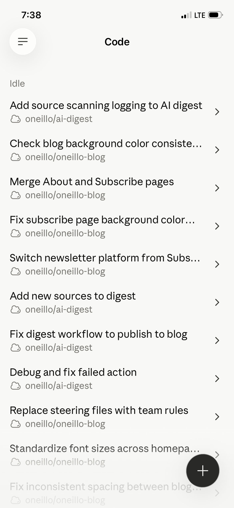
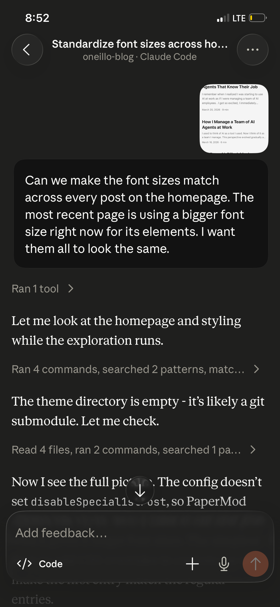

Agentic AI, like Kiro CLI and Claude Code, has dramatically and permanently changed the way I do things, including managing this blog.

A few years ago, I set up a new blog. I wanted to do it cheaply, and I landed on using [Jekyll](https://jekyllrb.com/) and GitHub. It took an entire weekend of reading the Jekyll docs, tinkering, and troubleshooting to launch the blog and configure it to my liking. I spent a lot of hours on it, but I wound up with a setup I fully understood and could easily manage.

For this blog, I was initially going to fire up Jekyll again. I'd have to relearn it in my limited free time, but I was familiar with it and had previously liked it. Best of all, I knew it was free.

Before starting, I used Claude to research other options. It prepared a report that included [Hugo](https://gohugo.io/), its top recommendation given my requirements. After a few more questions to learn how Hugo compared to Jekyll, we were off to the races.

Setting up the Hugo blog was nothing like my prior experiences. It took ~40 minutes. I never looked at the documentation. Most of the work was done by Claude Code, which provided detailed step-by-step instructions for the parts I had to do.

It was incredibly easy to go from nothing to a live Hugo blog with Claude.

Over the coming weeks, I continued to use Claude to tweak and improve the blog…from my phone!

I learned I could point Claude Code in the iOS app to my blog's GitHub repo, ask it to change something, and get it done from anywhere, anytime.

I've done this a lot.

Whenever I want to change something, I just have to describe it in plain English.

Occasionally I add a screenshot to the chat to help illustrate the issue I want to address.

With agentic AI, it's so much easier to tackle projects, including ones that would require a lot of initial research to get done. That's great for someone like me who has very limited free time. And I'm having a blast playing around with it.

The flip side is that I'm not very familiar with how Hugo works.

I'm completely dependent on Claude for my blog. I have to rely on Claude to publish blog posts, update content, and make changes to the site. If I lose access to it, I'm going to have to bite the bullet and do the work that Claude saved me from doing to learn how my blog works.

I'm now gradually learning Hugo because I'm uncomfortable with that dependency for my personal blog. I'm also starting to experiment with running LLMs locally for situations where I don't have internet access.

This experience has also given me a better sense of the tradeoff of using AI agents to get things done quickly.

With AI agents, you can save a lot of time, but you sacrifice learning and understanding, especially when you are working in an area that falls outside of your expertise.

It's good to think about what skills and what knowledge are worth the effort to build. Once you identify those items, you can then pivot to using LLMs to help you learn and overcome any blockers you run into along the way.

This is one of my favorite things to do now; kicking off a Claude research project for something I want to learn and using the artifact it creates as a primer.
