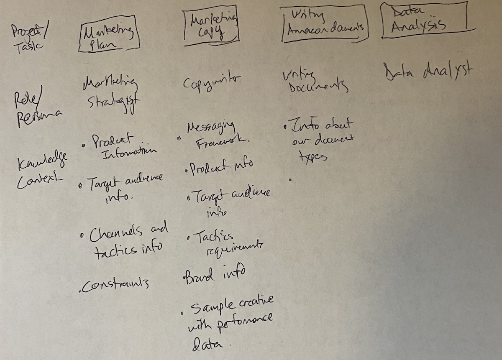
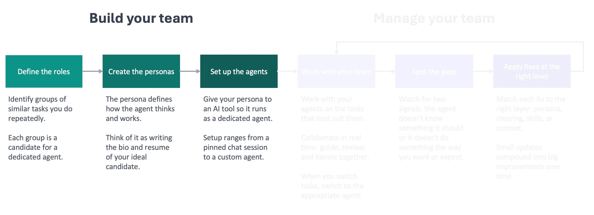
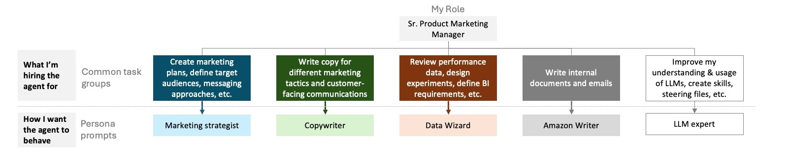

I remember when I realized I was starting to use AI at work as if I were [managing a team of AI employees](). I got so excited, I immediately sketched the idea on a sheet of paper so I could share it with my teammates.



What started as a sketch is now core to how I use AI agents to do things faster and better at work and at home. It's an approach that naturally guides you toward the [context engineering best practices](https://www.anthropic.com/engineering/effective-context-engineering-for-ai-agents) that improve LLM output.

The reason this approach works well is that it uses one of the two available levers to improve how well a best-in-class large language model (LLM) works for you.

1. Fine-tuning: this is where you take an LLM and train it further using your own data so it becomes more specialized for your needs.
2. In-context learning: giving the LLM the right expertise (persona), knowledge (context files), workflows (skills), and rules in each session (steering files).

For most people, fine-tuning is going to be out of reach. Even if you could fine-tune a model, you'd have to retrain it repeatedly to keep up with changes in your work. Otherwise, the model would grow stale. In-context learning is how you keep the model relevant between retraining cycles, and for most people, it's the only lever available.

It all starts with building your team.



#### Define the roles

The first step is to define the roles for your team by identifying the groups of similar tasks you do over and over again. It might help to start with pen and paper like I did.

List out the things you do at work or at home on your computer. Don't overthink it; just write them down. Then group the ones that are similar in terms of how you approach them (required behavior) and the information you need to do them (required context).

The groups of items you do most often and that take the most time are the best candidates for roles because they'll benefit the most from ongoing improvement. On those tasks, you can work with an agent frequently enough to spot gaps that lead to improvements that you'll continue to benefit from.

As you build your team, keep in mind that the [ideal number of direct reports for a manager tends to be 8-9](https://www.quantumworkplace.com/future-of-work/whats-the-optimal-span-of-control-for-people-managers). This principle also applies to AI agents. The more you have, the more complex it gets to keep up with the feedback and improvement loop for each one. Remember, you're not building a department. You're building a team.

In my role as a Sr Product Marketing Manager, I've landed on five agents that I work with daily:



I'm setting up a different team at home: an editor, financial advisor, and personal trainer.

#### Create the personas

Creating the personas will be quicker than you think, because you're going to use AI to help create them.

Start with the role that you feel the most comfortable defining. Spend a little time thinking about how you'd want the agent in that role to behave. What should it do? What should it never do? Don't overthink it. You're not going for perfection. You're going for something that you can provide an LLM, like ChatGPT or Claude, to help it create a persona prompt for you. Keep it simple so you don't get hung up on this step. The feedback loop will improve it over time.

Next, start a chat with the best-performing model you have access to. Regardless of what you are using, if you have the option to select a model, select the latest frontier model from that provider. Starting with a better quality model means you're more likely to start with a good persona prompt. That's less distance to close with the feedback loop to get to an agent that starts to materially improve the work it was created for.

In the chat, ask it to help you create a persona prompt. Let it know the role you have in mind, the type of work you're going to use it for, and how you want the agent to behave. I've included a prompt at the end of this post that you can copy into Claude, ChatGPT, Gemini, or your tool of choice to walk you through creating your persona prompt.

Review what the model writes for you, and iterate on it as needed. If something doesn't sound right, let the model know what the issue is and ask it to update the prompt. You don't need to use any kind of special language to get this done. Treat it like a conversation you're having with a coworker to improve a document. And remember what I mentioned before: there's no need to be precious about this. This is a starting point that you're going to refine through the feedback loop.

A good prompt is going to define the agent's identity briefly (1-2 sentences) and focus primarily on behavioral guidance for the agent. This includes how to approach tasks, standards to enforce, and what to prioritize. It's also helpful to include specific things the agent shouldn't do in this type of role. For example, I don't want my data wizard to ignore a sudden spike or decrease in a metric, because I've learned that generally doesn't happen without some external factor causing it.

After you create your persona prompts, take a step back and think about how you created them. You delegated the persona draft to an LLM. That's not a shortcut. You're not cheating. That's the whole point of creating your AI team. You're going to be delegating more and more work to them, and this is the first point in the framework where you do that.

As you build trust with your agents, you're going to start to delegate more to them: bigger tasks, more autonomy, more trust. This is exactly what it's like to be a manager when you're working with a new employee. You're initially close to what they're doing, you build trust, and then you start to give them the room to run. That's when you start to really see the benefits of adding that employee to your team. It's the same thing here. The earlier you get comfortable delegating work to the AI agents, the faster everything in the framework will start to pay off.

#### Set up the agents

The last thing you need to do to build your team is set up the agents by loading the persona prompt into whatever tool you're using. The specifics are going to vary based on the tool you're using, e.g. Claude Code versus Kiro CLI. I'll cover how to do this in more detail in an upcoming post in this series. For now, you just need to remember that the persona prompt is the foundation for each agent on your team.

Building your AI team is straightforward. You're the expert at what you do and how to do it well. Use your experience and expertise to guide an LLM to build persona prompts for AI agents to fill your open roles. That gets them hired. The knowledge base you'll create is what gets them up to speed and delivering high-quality work for you.


#### Resource: prompt you can use with an LLM to help create your persona prompts

```
I need you to help me write a persona prompt — a set of instructions that will shape how an AI agent behaves every time it runs. Think of it as a job description the AI reads before every conversation.

Before writing anything, interview me. Ask these three questions one at a time, waiting for my response before moving on:

1. **What role does this agent play?** What's the domain and who does it serve? (If you know what platform or tools the agent will use, mention them — but don't worry if you're not sure.)
2. **What kinds of work will it do?** Describe the typical tasks or situations the agent will help with. Think about what a good day looks like — what does the agent do well?
3. **What behaviors matter most?** How should the agent approach its work? What should it do when it's unsure? Are there things it should always or never do?

After the interview, generate the persona prompt. Use what I told you as the foundation, but add your own recommendations — behaviors or guidelines that would make this agent more effective for the role, even if I didn't mention them. Call out anything you added so I can review it.

Follow these rules when writing the prompt:

### Focus on behaviors
- Describe what the agent should *do*, not what it *is*. "Start by understanding the full situation before proposing solutions" is a behavior the agent can act on. "You are thorough and thoughtful" is not — it's a personality trait, and the agent won't know how to translate that into action.
- Frame instructions as conditional guidance: "When X, do Y." This gives the agent concrete decision points rather than abstract qualities to live up to.
- If a behavior only applies sometimes, state the condition.

### Hit the right altitude
- Write at the level of a clear team lead briefing a competent new hire — not a legal contract, not a vague mission statement.
- Be specific enough to prevent the mistakes that actually happen, but flexible enough to let the agent use judgment in novel situations.
- Prefer "when X, prefer Y" over rigid step-by-step procedures. The agent needs guidance it can apply across situations, not a script that breaks the moment something unexpected comes up.

### Structure for the role
- Let the role dictate the structure. A coding agent needs different sections than a research agent or a writing coach. Don't force a template.
- Always lead with identity and scope — one or two sentences that establish who this agent is and what it does.
- After that, organize the remaining instructions into whatever sections make sense for this specific role. Use headers and bullets so the instructions are easy to scan.

### Keep it short
- A persona prompt competes with the user's actual questions and content for the agent's attention. The longer the prompt, the less room the agent has to focus on the real work.
- Aim for the shortest prompt that fully captures the desired behavior. If a line doesn't change how the agent acts, cut it.
- Leave out anything the agent would already know or can figure out from context.
- When in doubt, leave it out. A lean starting point that the user can build on is far more useful than a bloated prompt full of rules that haven't been tested. The user will discover what's missing by working with the agent and can add rules as needed.

### Output format
- Output only the final persona prompt, ready to use.
- After the prompt, add a short "Additions" section listing anything you added beyond what I described, with a one-line rationale for each. This section is for my review — it's not part of the persona prompt itself.
```
