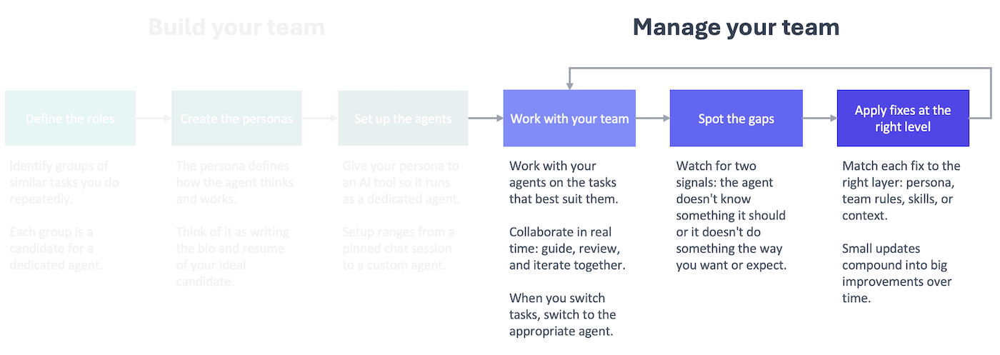

It's Friday afternoon, and you are reviewing the week's feedback logs with one of your agents. You notice that your Copywriter keeps using a formal tone for your social copy. Your Data Wizard keeps stating hypotheses as facts. Your Chief of Staff keeps forgetting to block 45 minutes for launch when you plan your day each morning. 

To address the first issue, you need to update your Copywriter's persona. The second issue is already covered in a team rule, but it needs to be sharpened. You can fix the last one in the `Plan my day` skill. Your agent makes the required changes so that next week you are less likely to hit these issues again.

This is what managing your team of AI agents looks like in practice. It's not a big project or one-time effort. It's a small, regular process that helps you identify and correct issues with your team as you work with them. Those small fixes compound into big improvements over time.



## Why you need a feedback loop

AI agents have limited mental energy per session (the context window), and their work gets worse as they use it up. Therefore, to get the best output possible, you need to work with agents on focused sessions that are tackling a specific task (or clear the session context to move on to the next task). 

That means over the course of a week, you'll have a lot of short, working sessions with your agents. In those sessions, you'll give them guidance and corrections to improve what they're doing. The issues you correct in one session will pop up again in a future session if you don't address them permanently in your setup.

You might be tempted to address every issue as you go, but then you are using the session to improve your setup rather than get the task done. That's why it's better to do all of the improvements together in a separate session that you run periodically. You stay focused on the task, and your setup changes get the attention they deserve.

Every fix you apply to your setup takes up some of the available context window at the start of the session, so you should focus on fixing issues that you encounter repeatedly across sessions. 

That's why you can't just keep the corrections in your head. You'll forget what the core issues are. 

A formal feedback loop ensures you are collecting the necessary information between review sessions to make informed changes to your setup.

## Capturing the feedback

Feedback is the fuel that drives the process, so you need to capture it consistently across all of your sessions. 

To do this, I moved away from capturing individual pieces of feedback in the moment to instead making it part of my routine to end a working session. I now have a `close-shop` skill at work and at home that I run at the end of every session or before I clear session context to move on to the next task. The `close-shop` skill runs multiple skills, including one that logs session feedback. See the bottom of this post for the `session-feedback` skill I use at work.

The agent decides what goes into the feedback log, not you. That allows you to stay focused on the task at hand, collaborating with your agent to get the work done. At the end, the agent picks up feedback that it thinks would help it work better in the future.

Not every session will result in a feedback entry, and that's fine. The point is that you get in the habit of giving your agents an opportunity to reflect and look for feedback worth saving across every session.

To simplify things, keep all of the feedback in one file in a central location. You can set it up so that every entry specifies what agent recorded the feedback. That's helpful for when you do the review to determine if this needs to be addressed via a team rule, a persona update, a skill change, or a knowledge base update. 

## Addressing the feedback: the weekly audit

Once a week on Fridays, work with an agent to review the feedback logs to determine what to fix and how. Think of it as a weekly 1-on-1 with your team where you review the past week and prepare for the coming week. 

There are two components to the review, both of which your agent will help you do: triaging the feedback and addressing it. In the first step, you are looking for issues that are worth addressing in the logs. In the second step, you are deciding at what level to address the issue and implementing the fix via your agent.

The nature of the issue helps determine the best way to fix it.

* Does it apply to every agent, every session? **Team rule**
* Is it specific to one agent? **Persona prompt**
* Is it specific to a repeatable task? **Skill**
* Is the issue that your agent(s) were missing information they needed? **Knowledge base**

The first time you review the feedback, you can go through the entire process manually. Afterward, ask your agent to create a skill so you have a repeatable process for it in the future. You can see my `audit-feedback` skill below.

The agent will make recommendations about what to address and how, but push back on anything that doesn't make sense. Remember, you are managing the team, and that takes work.

Watch this video to see me go through the process at home, working through real issues with real fixes.


This is a management practice, and you'll get out of it what you put into it. The underlying tools are simple: a feedback log, an audit cadence, and a framework for deciding what to fix and how. By doing this consistently, though, you ensure that your team keeps getting better because you're investing in their development the same way a good manager invests in their people.

The Managed AI Framework is tool-agnostic. The implementation isn't. Are you ready to meet my teams?

***

## session-feedback skill example

This is the `session-feedback` that I use at work. I worked with my `LLM Expert` agent to create this skill.

````
---
name: session-feedback
description: Reflect on the current session and append generalizable feedback to the agent's feedback log. Invoke at the end of a working session to capture learnings that could improve the agent's persona prompt, steering rules, or skills. Focus on patterns and principles, not task-specific details.
---

# Session Feedback

## When to Use

The user asks you to log feedback, reflect on the session, or invokes this skill at the end of a working session.

## How to Run

1. **Identify the agent.** Determine which agent persona the session's work was primarily done by. Check the conversation for subagent delegations — if the corrections and learnings came from a delegated agent (e.g., marketing-strategist, writer), the feedback belongs in that agent's log, not the executing agent's log. When in doubt, infer from the suggested fixes (which persona do they target?).
2. Review the conversation history from this session.
3. Identify moments where:
   - The user corrected you or pushed back on your output
   - You had to be asked to do something differently than your default behavior
   - The user provided a preference that isn't captured in your persona or steering rules
   - Your output required multiple rounds of revision to get right
   - Something worked particularly well that isn't explicitly codified
3. For each observation, ask: **"Is there a general principle here, or is this specific to this task?"** Only log observations that point to a reusable principle — something that would improve your performance across future tasks, not just this one.
4. Append the entry to your feedback log. No approval needed — just do it and show the user what you logged.
5. If the feedback also qualifies as a memory entry (user preference or working pattern), append it to `~/.kiro/steering/memory.md` as well.

## Feedback Log Location

Append to: `~/ai/logs/feedback/feedback.md` — a single consolidated log shared by all agents.

If the file doesn't exist, create it with this header:

```
# Feedback Log

Generalizable learnings from working sessions. Used periodically to inform persona prompt and steering rule updates.
```

## Entry Format

Tag each entry with the agent identified in step 1 (not necessarily the agent executing this skill).

```
## <Date> — <agent-name>

- **Observation:** <What happened — one sentence, no task-specific details>
- **Principle:** <The general rule or preference this points to>
- **Suggested fix:** <Where this should be addressed (persona, steering, or skill), why that scope is right (e.g., "steering — applies across all document-creation personas" vs. "persona — only relevant to requirements writing"), and a brief idea of the change>
```

## Rules

- **Abstract, don't narrate.** Don't describe what the task was. Describe the behavioral pattern that needs to change or be reinforced.
- **One principle per bullet.** If an observation points to two different principles, split them.
- **Skip if nothing generalizable emerged.** Not every session produces feedback. If the session went smoothly and all corrections were task-specific, say so and don't append anything.
- **Keep entries concise.** Each entry should be scannable in under 30 seconds. The LLM expert will review these in batch — density matters.
- **Don't duplicate.** Before appending, read the existing log. If the same principle is already captured, note that it recurred (add a date) rather than creating a new entry.
- **Cross-log patterns.** If a principle seems like it would apply to other personas too, note that in the suggested fix. When the same principle appears across multiple persona logs, it's a signal for a steering file rather than a persona-level fix.

## When Reviewing Logs

Before promoting feedback into a persona or steering change, each entry should pass two tests:

1. **Recurrence:** Will this fire frequently enough to justify every agent (or this agent) reading it on every interaction?
2. **Specificity:** Is the fix concrete enough to change behavior, or is it vague advice the model would already "know"?

Drop entries that fail either test.

````

## audit-feedback skill example

````
---
name: audit-feedback-logs
description: Audit all agent feedback logs and recommend changes to steering files, personas, or skills. Filters entries through recurrence and specificity tests, cross-references existing config to avoid duplicates, and proposes changes at the right level.
---

# Audit Feedback Logs

## When to Use

The user asks to audit feedback, review feedback logs, or promote feedback into setup changes.

## How to Run

### Step 1: Read all feedback logs and existing config

Read in parallel:
- `~/ai/logs/feedback/feedback.md` (the consolidated feedback log)
- All files in `~/.kiro/steering/`
- All persona files in `~/ai/personas/`

Skim skill files only when a feedback entry's suggested fix references a specific skill.

### Step 2: Filter entries

For each feedback entry, apply two tests:

1. **Recurrence:** Will this fire frequently enough to justify every agent (or this agent) reading it on every interaction? If it addresses a rare edge case, skip it.
2. **Specificity:** Is the fix concrete enough to change behavior? If it's vague advice the model would already "know," skip it.

Drop entries that fail either test.

### Step 3: Deduplicate against existing config

For each surviving entry, check whether the principle is already covered by an existing steering rule, persona instruction, or skill rule. If it is, skip it. If it's partially covered, note what's missing.

### Step 4: Determine the right level

Place each fix at the narrowest scope that covers its recurrence pattern:

| Level | Use when... |
|---|---|
| Steering file | The principle applies across multiple agents. All agents read steering files on every interaction, so the token cost is shared. |
| Persona | The principle applies to one agent across many tasks. |
| Skill | The principle applies to one agent in one specific workflow. |

When in doubt, prefer the narrower scope — it's cheaper and easier to promote later than to demote.

### Step 5: Present recommendations

Group recommendations into three categories:
- **Worth implementing** — passes both tests, not already covered, clear placement
- **Borderline** — passes tests but low recurrence or partially covered; flag for user decision
- **Not worth implementing** — fails a test; briefly explain why

For each recommendation, state:
- The principle (one sentence)
- Where it goes (specific file name and section)
- Why that level (one sentence)

Wait for user approval before making any changes.

### Step 6: Implement approved changes

Make the approved edits. After all changes are applied, list what was changed with file paths.

### Step 7: Mark processed entries

After implementation, do NOT delete feedback log entries — they're the historical record. The deduplication in Step 3 prevents re-processing on future audits.

## Rules

- Never auto-implement. Always present and wait for approval.
- Don't rewrite existing steering rules to absorb new feedback — add to them. Rewriting risks losing nuance from the original.
- If two feedback entries from different agents point to the same principle, that's a strong signal for steering level.
- If a feedback entry suggests a fix that contradicts an existing steering rule, flag the conflict for the user rather than resolving it yourself.
````
