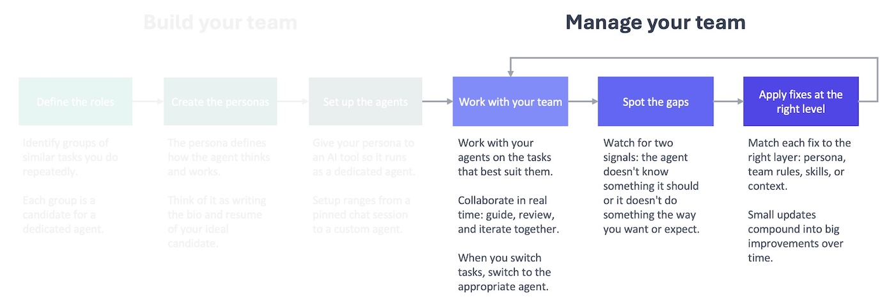
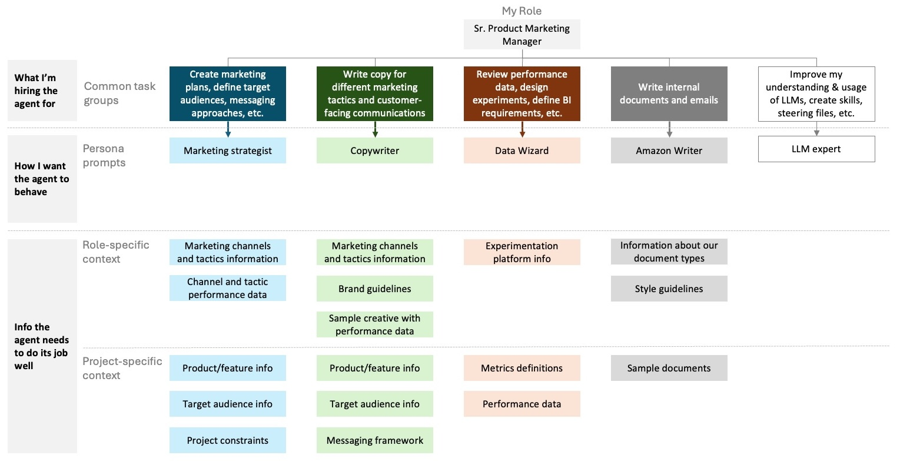

In the last post, you [built your team](), and now you can start managing your team. Pick the agent that makes the most sense for the task at hand, and work with them on it. When you move on to a new task, open a new session with the appropriate agent for that task.

As you work with your team, you'll quickly notice that you're giving them the same facts and details over and over again. They're good in their roles, but they don't know anything about your specific job. Your Marketing Strategist doesn't know what products you're working on. Your Data Wizard doesn't know what the metrics mean in the data they're analyzing. Your Copywriter doesn't know which value props to highlight in your ad copy. They're missing information they need to do the work. You've run into the first type of gap: a knowledge gap. Now you need to fix it.



To close a knowledge gap, you need to start building a knowledge base that has the type of information a new hire would get during onboarding.

Think of the knowledge base as the wiki you're building for your AI team. It contains relevant and useful content that's easy to find whenever they need it. That includes information they'll refer to all the time, like a style guide, and information they'll need for specific projects, like a project brief.

In practice, a knowledge base is just a collection of files your agents can access, organized so the right information is easy to find.



## No skimming, no stamina
This will be incredibly useful for your team as long as you keep in mind two constraints.

AI agents don't skim or skip. They have to read everything in order to find anything. It doesn't matter if what they need is in the first sentence of a document. They still have to read the entire document, which is not ideal.

This is a problem because AI agents have limited mental energy. The more they read, the worse they get. You don't want to give them a book and ask them to find the three facts they need for a task. You want to give them a one-pager with those three facts.

## Pages, not books
Instead of using one file that has everything in it, create a knowledge base that has a lot of files in it. Every file should cover a distinct and unique topic. Some of these will contain information that is more permanent and broadly applicable (role-specific). Others will contain information that is for specific projects or tasks (project-specific). With separate files, your agents can mix and match to get exactly what they need.

For example, I work with my Marketing Strategist across multiple products I support. They always need to know what marketing channels and tactics are available regardless of what product we're working on. But if we're working on Product A, they don't need to know about the value props, target audience, or positioning of Product B.

## Signposts, not search bars
When it comes to setting up your knowledge base, the overall principle is that if it would help you find a piece of information, it would also help your agents. This should guide how you organize, name, and store your information.

Imagine if you kept all of your files in one folder, and you had to find a specific file without being able to search for it. That would be a nightmare (or at least really time-consuming). Instead, you probably organize your files across different folders that have descriptive names. If you go into a folder named "Product A," you know that you are going to find more files and folders in it that are related to that product.

You should do the same for your knowledge base: create a folder hierarchy that makes it easier for an agent to browse through all of the available files. For example, I keep my role-specific and project-specific information in separate folders. Every project gets its own folder where I can keep the project-specific files.

This is a simplified version of my knowledge base folder at work.

```
~/ai/
├── context/                                    # Persistent reference knowledge — rarely changes
│   ├── products/                               # One folder per product
│   │   ├── product-a/
│   │   │   ├── product-a-product-overview.md
│   │   │   ├── product-a-messaging-framework.md
│   │   │   └── product-a-key-metric-definition.md
│   │   └── product-b/
│   ├── marketing/                              # Domain knowledge (not product-specific)
│   │   ├── channels/
│   │   │   └── marketing-channel-overview.md
│   └── document-examples/                      # Few-shot examples for document generation
│       ├── business-requirements-documents/
│       │   └── product-a-brd.md
│       └── strategy-documents/
│
└── projects/                                   # Active and completed work — organized by product
    ├── product-a/
    │   ├── reports/
    │   │   ├── key-metrics/
    │   │   │   ├── key-metrics-report-2026-01.md
    │   │   │   └── key-metrics-report-2026-02.md
    │   │   └── business-reviews/
    │   └── project-1/                           # Time-scoped project folders
    └── misc/                                    # Cross-product or exploratory work
        └── project-1/
```


The names of the files in your knowledge base are another important clue your agents can use to determine if they're relevant. You are less likely to know what's in a file called "document" than you are with a file called "product-a-overview-and-positioning." It's the same for an agent considering whether to read that file.

Once you open a file, you probably don't want to read all of it to know if it's useful. A summary at the top is helpful to get the gist of the content and determine if you should continue reading. You can do the same in your knowledge base files with a few lines at the top that tell the agent what this file is about and whether it's worth reading, like:

```
---
title: "Project Orion Launch Brief"
product: "Orion Analytics Dashboard"
status: active
date_updated: 2026-03-10
summary: Redesign of the analytics dashboard to support real-time data streaming. Goal is reducing time-to-insight for enterprise customers by 40%. Use this file when working on any Orion-related marketing, messaging, or launch planning tasks.
---
```

You can see a full example of a knowledge base file at the bottom of this post.

You used LLMs to help you create your persona prompts, and you can also use them to set up your knowledge base. Whether you're a type-A person who has all of your MBA notes from 15 years ago scanned and searchable, like me, or more of a go-with-the-flow type, this is another place to let an LLM take the first pass. Don't get too hung up on the details or strive for perfection. That's why there is a feedback loop in the process: so you can move quickly and make improvements that address real issues.

It's the same approach as in the last post: you let the LLM take the first pass and then refine as you go. The earlier you build that habit, the faster the whole framework is going to pay off.

Your team is more knowledgeable, but that isn't enough to guarantee you get consistent, high-quality work. You still need to give them an employee handbook and a set of standard operating procedures to fix the second type of gap: behavioral gaps.

## Resource: prompt you can use to design a knowledge base for your AI agents

```
I'm building a knowledge base for a team of AI agents. The knowledge base is a collection of markdown and CSV files that any agent on the team can access. Not every agent needs every file — they'll pull in what's relevant to each task.

Help me figure out what files I need. Interview me with the following questions, one at a time. Ask each question, wait for my response, then move to the next.

1. What agents did you set up? For each one, briefly describe the role and the kinds of tasks they'll handle.
2. What information comes up repeatedly across your agents' work, regardless of which agent is doing it? Think about context that any of them might need.
3. Are there specific products, projects, or workstreams that your agents support?
4. Are there reference documents or standards that multiple agents would need access to?

After the interview, propose a knowledge base structure:
- A folder layout with descriptive names, separating role-specific files (broadly useful across projects) from project-specific files (tied to a particular product or workstream)
- A list of recommended files, each with a one-line description of what it should contain and whether it's role-specific or project-specific

Based on what you learn about my setup, propose a YAML frontmatter format for my knowledge base files. Every file should have a title, status, date updated, and a short summary describing what the file contains and when an agent should use it. Beyond those basics, add fields that make sense for my situation — for example, a product field if I support multiple products, or a domain field if my agents span different areas of expertise. Explain why you chose the fields you did.

Include the proposed frontmatter in each recommended file.

Keep every file focused on a single topic. Aim for files that are 1-2 pages, not 10. If a topic is too broad for one file, split it.
```

## Example: what a knowledge base file looks like

```
---
title: "Project Orion Launch Brief"
product: "Orion Analytics Dashboard"
status: active
date_updated: 2026-03-10
summary: Redesign of the analytics dashboard to support real-time data streaming. Goal is reducing time-to-insight for enterprise customers by 40%. Use this file when working on any Orion-related marketing, messaging, or launch planning tasks.
---

## What is Project Orion?

Orion is a redesign of the existing analytics dashboard for enterprise customers. The current dashboard refreshes data every 15 minutes. Orion introduces real-time streaming so customers see their data as it happens.

This is not a new product. It's a major upgrade to an existing product that enterprise customers already use daily.

## Business goal

Reduce time-to-insight for enterprise customers by 40%. The current delay between data generation and dashboard visibility is the #1 support complaint and the #1 reason prospects cite for choosing competitors.

## Target audience

- Primary: existing enterprise customers (upgrade path)
- Secondary: mid-market prospects evaluating analytics platforms for the first time
- Not targeting: SMB or self-serve customers (Orion is enterprise-tier only)

## Key messaging pillars

1. **Real-time, not near-time.** Competitors claim "real-time" but deliver 5-minute delays. Orion streams data in under 10 seconds.
2. **Zero migration effort.** Existing dashboards carry over. No rebuilding, no re-learning.
3. **Built for the analysts, not just the admins.** The redesign focuses on the daily experience of the people who actually use the dashboard, not just the people who set it up.

## Competitive context

- Competitor A offers real-time but requires a full dashboard rebuild on migration
- Competitor B has a faster refresh rate (5 min) but no true streaming
- Our advantage is real-time streaming with zero migration friction

## Launch timeline

- Beta: April 2026 (50 enterprise customers)
- GA: June 2026
- Marketing launch campaign begins two weeks before GA

## What this file does not cover

- Pricing and packaging (see `orion-pricing-and-tiers.md`)
- Technical architecture (see `orion-technical-specs.md`)
- Full competitive analysis (see `competitive-landscape.md`)
```
