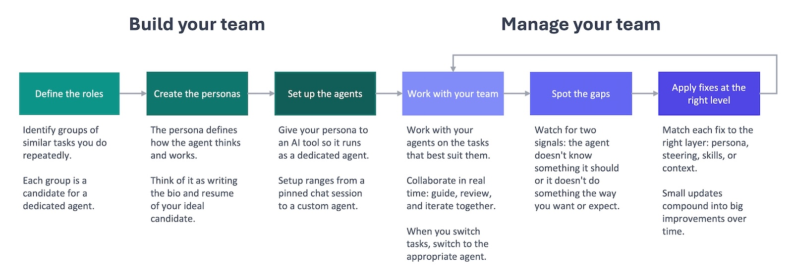

I used to think of AI as a tool I used. Now I think of it as a team I manage. This perspective evolved gradually as I used it daily and found myself rewriting the same persona prompts over and over again for the same types of tasks. I started systematically improving what I was doing until I found myself managing a team, which happened to be made up of AI agents, at the end of the [7-month journey that made me an AI enthusiast]().

When you are managing a team, you have to scope the roles for your team and fill them with people who can be successful in those roles. To do that, you hire folks with the right backgrounds and experience. Every member of my AI team has a persona prompt that describes the background and experience I want for the role they're filling.

You want to ensure your team has the information they need to do their work, like a wiki with product information, target audience insights, document templates, and standard operating procedures. You're giving them the context they lack when they step into that role, and I do the same with a structured knowledge base, project-specific context files, and reusable skills that describe how to do specific tasks.

Lastly, you want to develop your team with feedback and guidance tailored to them. I'm using feedback loops to capture issues and improve their work via the persona prompts, steering files, skills, and knowledge base.

I built my team through trial and error, but I now have a framework for how to do this, which I'm breaking down into two phases: build your team and manage your team. Each phase contains three steps:

**Build your team**

1. Define the roles
2. Create the personas
3. Set up the agents

**Manage your team**

1. Work with your team
2. Spot the gaps
3. Apply fixes at the right level

In order to build the right team, you need to figure out what roles you need to fill. Start by identifying similar types of tasks that you have to do often in your role; those groups of tasks represent job openings that you could fill with an AI agent. I've found that my most useful agents are the ones that I work with often, since that supports the ongoing cycle of improvement, so I try to avoid creating a custom agent with too narrow a scope that I won't work with often.

I also don't want to have to juggle a team of 30 agents every day. I think the best practice of keeping a manager's span of control to ~8 or fewer employees also makes sense in this context. You'll then build a persona prompt for each job opening that defines the ideal candidate's identity, expertise, and working style. Once you have the persona, that serves as the foundation for the AI agent you'll set up in a tool like Kiro or Claude Code to be on your team.

To manage your team, you have to understand their strengths and weaknesses, and that means working closely with them. You'll want to work with the right agent for the task at hand. As you work with them, you'll start noticing recurring gaps that you need to address to improve your team. Some of those will be knowledge gaps, where the team needs more information, and others will be behavioral gaps, where your agents aren't doing something the way you'd like them to or expect them to.

Based on the gap, you'll want to address the situation at the right level. That might entail adding a new context file to the team's knowledge base or updating an agent's persona. These small tweaks will start to lead to big improvements, but this isn't a set it and forget it kind of deal. It's a continuous management process that never really ends.

I've noticed that my team is producing better work in less time with this approach, but I don't have an objective way to measure or validate that. I want to learn more about LLM evaluation techniques so I can get to objective measurement, but in the meantime, I have some validation from others at work. First, I've started to get compliments from copywriters on the draft marketing copy I'm writing with my Copywriter AI agent. Second, I shared the first draft of a monthly business review document my team wrote with my counterpart on the product side. I let her know it was all AI-generated (the analysis and the write-up), and I asked her to review and check if there was potential there. She was so impressed with the quality of the MBR, she started asking me questions about how I'd put it together and what my setup was. Lastly, I was able to write a good business requirements document from scratch in one day because the infrastructure was already in place.

Building and managing an AI team is much harder than just using a chatbot or the default agent that you get with something like Kiro or Claude Code. It takes upfront work to scope the roles, build the personas, and create the infrastructure to support the ongoing improvement. A lot of that work will happen before you start to see the results, but it will start to compound. Pieces will build on top of other pieces, and things will get faster, both because you'll start to optimize the process to your work style and because your agents will get better. I don't have the data yet to prove this is better, but I've seen enough to think the effort is worth it. So I'm currently setting up the same approach at home with Claude Code.

That's a high-level overview of my managed AI framework. I'm going to dive deep into each area of the framework with separate posts on building your team, setting up the knowledge base, working with skills and steering files to set expectations and requirements, and creating a feedback loop to drive the ongoing improvement. I'll then cover how I've implemented this in Kiro CLI at work and Claude Code at home. I'll end the series with a post on the learnings and best practices I've picked up along the way. By the end, you should have a good roadmap with explicit examples to allow you to set up your own team.

I want to develop my skills, deliver better results, and spend more time with my family. This framework is how I'm doing that. It's a tool-agnostic approach that can help move you away from using one-size-fits-all tools to building an AI team that's tailored to your needs and able to deliver better results for you.
