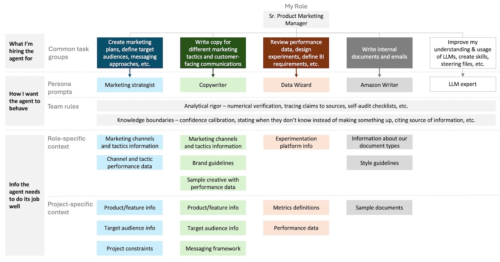
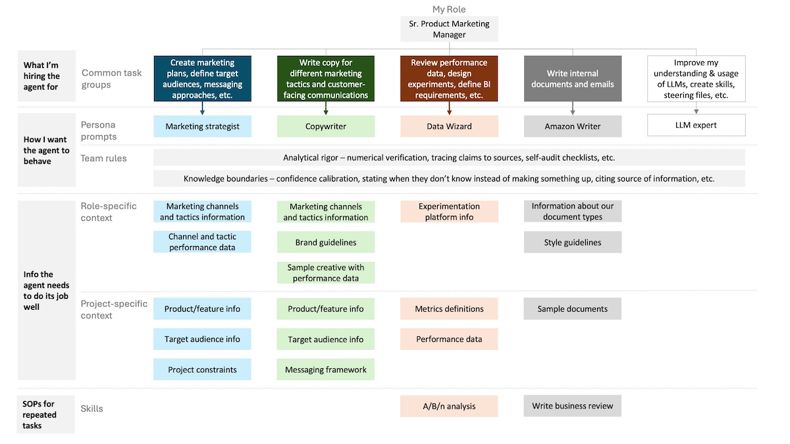

With a [knowledge base](), your team has the context they need to do their jobs. But you're still going to run into issues when you work with them. 

Your Copywriter gives you character counts for ad copy that are inaccurate. Your Data Wizard states unproven claims about why a metric went up or down as facts. You continue to have to tell your Marketing Strategist to look at audience insights to inform their messaging recommendations. Your team creates files in the wrong place.

These are all examples of the second type of gap you'll regularly encounter: behavioral gaps. That's when your agent doesn't behave the way you'd like or expect. You can't fix this gap with context files in a knowledge base. Instead, you're going to have to use team rules and skills.

## Team rules: the employee handbook

Team rules are where you lay out how your agents are expected to operate, always. That includes both behavioral standards, like principles around tone and accuracy, and operational context to help them work more effectively in your environment, like information about your knowledge base structure.



Your team rules are context that all of your agents load all of the time. That makes them ideal for addressing persistent, universal behavioral issues, like LLMs' tendency to make up information (hallucination) and to be overly agreeable and supportive (sycophancy). 

That also means they use your agent's limited mental energy (context window) in every session. This happens regardless of whether the rules are relevant to the task at hand. The more team rules you have, the less mental energy your team has to work on anything. Therefore, you want to be very careful about what makes it into your team rules.

Reserve your team rules for rules that apply to every agent, every session. If a rule only applies to one agent, then it belongs in the persona prompt. 

Here's an excerpt from one of my team rules at work (full version below the post) that sets the standard for any work with data and metrics.

```
# Analytical Rigor Rules

## Numerical Verification

When performing any analysis involving numbers, calculations, or quantitative claims:

- After completing calculations, re-derive key figures from source data before stating them
- When citing numbers from provided data, quote the exact source value alongside any derived metric
- If performing multi-step calculations, show intermediate steps — do not skip to final answers
- When comparing values (percentages, ratios, deltas), state both raw values and the derived comparison
```

This rule helps reduce the likelihood my team will make a mistake when they work with numbers.

Different tools implement team rules in different ways. Kiro uses steering files. Claude uses CLAUDE.md files. Codex uses AGENTS.md files. Different names, same concept.

## Skills: the standard operating procedures

Skills enable your agents to perform the same task the same way to deliver consistent results. You can define, in plain English, the steps you want them to perform, the tools you want them to use, the quality checks they should perform, and anything else that is important to completing a task the way you'd like it done. They are like standard operating procedures (SOPs) for tasks your AI team will do often.



Unlike team rules, skills are only loaded by the agent when they're needed, so they use less of your agent's available mental energy. Your agents are given just enough information to know what skills are available and what they're for so they can determine when they should use them. It works pretty well in practice, but I do sometimes have to nudge an agent on my team to use an available skill.

I use a skill at work to help me process tutorial videos that I've started capturing of my Kiro CLI sessions. The skill tells my LLM Expert agent to:

1. Create a second copy of the video to work with.
2. Reduce the file size of the video.
3. Perform an audio pass to soften any pops or loud percussive sounds if there's a voiceover.
4. Extract the video contents. If there's audio, use a local Whisper speech-to-text model to transcribe it. Otherwise, sample frames from the video every few seconds and read the images to determine what was covered.
5. Call the Copywriter agent to provide several options for a title, subtitle, and key takeaways for the video based on the video script created in the last step.
6. Ask me what options to use.
7. Create a title card and key takeaways card using those options to add to the video. Ensure the copy has good left and right margins and spacing before continuing. If not, adjust and recreate the cards.
8. Add the cards to the beginning and end of the video. 

I added the content extraction step after realizing it was taking too long to describe the video contents to my agent. I also added the margin check for the title cards after it created a few videos with the copy going edge-to-edge. 

Now whenever I record a video tutorial at work, I simply have to ask my LLM Expert agent to create title cards for the video. It runs the skill above and produces something that is ready for me to share with minimal additional input from me. This has saved me a lot of time as I've started to record more videos.

## Let your agents do the work

When you want to create team rules or skills, delegate the work out to your agents. You don't need to know what should go in the files or how they should be implemented. Simply describe to your agent what you are trying to accomplish and ask for its help to get it configured. You can have it walk you through what it's doing so you learn how it works and can refine its output to suit your needs. This is what you did to create your persona prompts and knowledge base, and hopefully you're starting to pick up on the pattern. You are managing your agents so they help you accomplish your goals. 

You've given your AI team the foundation they need to be successful, but that's not enough. Things are going to change. New issues are going to come up. Your team needs ongoing management, not just a good setup. That's what the feedback loop is for.

***

## Team rules example

This is an example of one of the team rules I use at work. It's in a markdown file that sits in Kiro's `~/.kiro/steering/` folder.

```
# Analytical Rigor Rules

## Numerical Verification

When performing any analysis involving numbers, calculations, or quantitative claims:

- After completing calculations, re-derive key figures from source data before stating them
- When citing numbers from provided data, quote the exact source value alongside any derived metric
- If performing multi-step calculations, show intermediate steps — do not skip to final answers
- When comparing values (percentages, ratios, deltas), state both raw values and the derived comparison

## Self-Audit on Analytical Outputs

Before finalizing any analysis, data summary, or document containing quantitative claims:

1. List every specific number or metric stated in the output
2. For each: trace it back to either source data or a shown calculation
3. Flag any number that cannot be traced — restate it as an estimate or remove it

## Prefer Code for Computation

When analysis requires arithmetic beyond simple operations (addition, subtraction, single-step percentages), write and execute code to compute results rather than performing mental math. State that code was used.

## Source-to-Output Sync

When updating a derived document (BRD, narrative, report) from a source file (CSV, spreadsheet, data export), run a programmatic diff that checks: new/deleted items, changed values, structural changes, and count mismatches. Present the diff summary before making updates. Don't rely on the user to enumerate what changed.
```

## Resource: Skill creation prompt

```
I want to turn a recurring workflow into a skill — a step-by-step standard operating procedure that an AI agent can follow to produce consistent, high-quality output every time.

Help me build this skill. Interview me with the following questions, one at a time. Ask each question, wait for my response, then move to the next.

1. What is the workflow you want to turn into a skill? Describe what it produces and why consistency matters for this particular task.
2. What are the inputs? What information or files does the agent need before it can start?
3. Walk me through how you do this task today, step by step. Include any steps where you review, check, or adjust before moving on.
4. What are the most common mistakes or failure points? Where does quality tend to drop when this task is done inconsistently?
5. Is there an example of a good output from this workflow? If so, describe what makes it good.

After the interview, produce a skill document in markdown with the following structure:

- **Name:** A short, descriptive name for the skill.
- **Purpose:** One or two sentences explaining what the skill does and when an agent should use it.
- **Inputs:** What the agent needs before starting (files, data, context, prior outputs).
- **Steps:** A numbered sequence of steps the agent should follow. Each step should be a clear, specific instruction — not a vague goal. Write steps as actions, not descriptions.
- **Quality gates:** After any step where errors are likely or quality matters most, add a checkpoint that tells the agent what to verify before continuing. Base these on the failure points I described.
- **Output:** What the final deliverable should look like, including format, length, and any standards it should meet.

Keep the skill focused on one workflow. If what I describe is actually multiple workflows, flag that and suggest how to split them into separate skills.
```

After you've used the prompt above to help you create the skill, you can also ask the agent to help you implement it (assuming it doesn't do it automatically).
